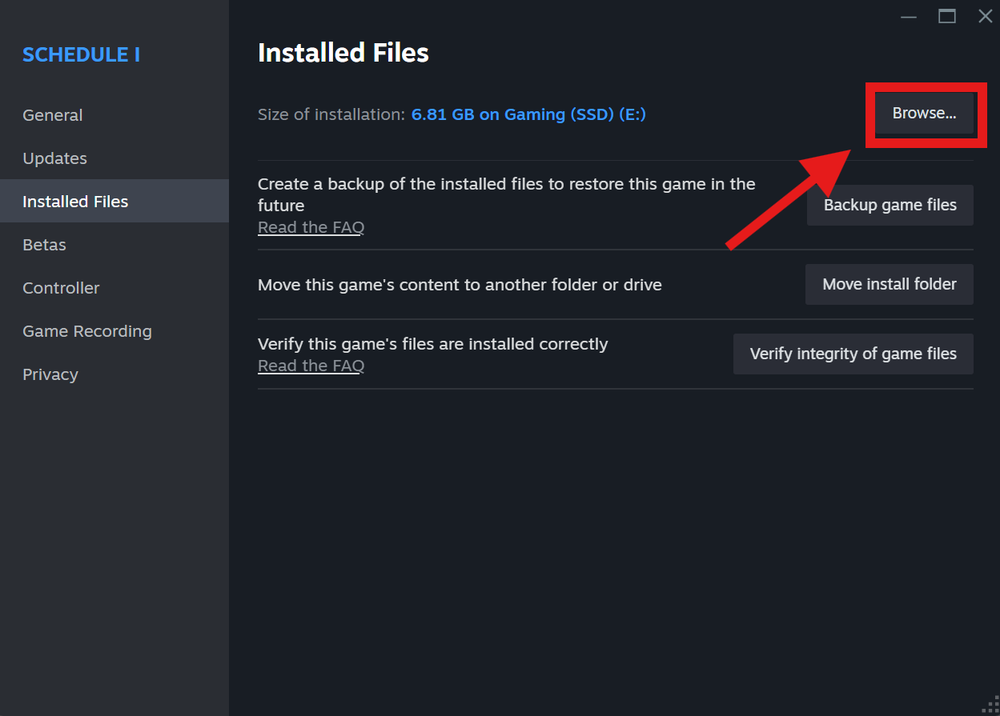

# Twitch Customers

> [!Note]
> If you are a user that just cares about the plugin and not how it was developed, feel free to skip the “How It Works” section, unless that sounds of interest to you!

## Overview

Twitch Customers is a BepInEx Unity plugin for the relatively new but already massively popular Steam game, [Schedule I](https://store.steampowered.com/app/3164500/Schedule_I/).

Its primary focus is on Twitch streamers who wish to add an element of interactivity with their audience, by allowing Twitch chatters to appear in the game as customers **in their single player sessions**.

## Prerequisites

* [Schedule I](https://store.steampowered.com/app/3164500/Schedule_I/): Yes, you need to buy the game on Steam. It’s fun, I promise! 🙂
* [BepInEx 6](https://docs.bepinex.dev/index.html): As Schedule I is an Il2Cpp game, the plugin was developed against pre-release [version 6.0.0-pre2](https://github.com/BepInEx/BepInEx/releases/tag/v6.0.0-pre.2).
  * When downloading BepInEx, download the Il2Cpp version for your operating system and CPU architecture (likely `win-x64`).

## Getting Started

Before installing the plugin, install BepInEx for Schedule I and run the game. This may take some time, as BepInEx will decompile the game first. Once the game loads and the main menu appears, close the game.

Download the `TwitchCustomers.dll` package from our [Releases page](https://github.com/ReservedKeyword/TwitchCustomers/releases), dragging it into the `BepInEx/plugins` directory, located within your game’s Steam directory.

Start Schedule I again, allowing the game *and plugin* time to fully launch, before exiting the game (again) once reaching the main menu.

Proceed to the next section in this document to learn how to configure the plugin!

## Configuration

The configuration file can be found in your game's root directory, where the plugin was installed.

The path will look similar to `/path/to/game/BepInEx/config/me.reservedkeyword.cfg`, where `/path/to/game` is the path to the Schedule I game directory. (See image above on how to locate where the game was downloaded.)

All plugin configuration options are as follows:

### `Enable Plugin`

Set to `true` if you want the plugin to load when the game launches, otherwise set it to `false`.

### `Preserve Original NPC Name`

Defines if, once a contract/deal has finished, the NPC should return to its original name.

If this value is set to `true`, once a contract/deal has finished, the NPC will return back to its original character name, meaning both the character, as well as the text message conversation chain found in the in-game Messages app.

If this value is set to `false`, once a contract/deal has finished, the NPC’s character and text message conversation chain will remain the Twitch chatter’s username until the character places another contract order, at which point their name will change to reflect a new Twitch chatter.

> [!Important]
> Regardless of this setting’s value, name preservation only persists within a single session. Once the session ends, either by exiting to the main menu or fully closing the game, all NPCs will return to their original name.

### `Channel Name`

The username of the Twitch channel the plugin should connect to in order to process the message command (see below).

Since the plugin effectively enters the chat room as an anonymous, read-only user, there is no authentication needed.

### `Blocklisted Chatters`

A comma-separated list of chatters whose messages will be fully ignored by the plugin.

Though you may add whomever you wish to this list, its original intent was to allow explicitly blocking messages from certain users, such as bots, like Stream Elements or Streamlabs.

### `Message Command`

The command that registers a Twitch chatter’s intent to be in the game. This string can be set to whatever you like, though it is recommended to be fairly unique to reduce the likelihood of unwanted messages getting caught.

As a quick aside, a Twitch chatter’s message is inspected to *contain* this phrase, meaning that it does not have to be their full message, nor does it have to begin with an exclamation mark (!).

### `Queue Size`

The maximum number of unique chatters that should be selected from at any given time. Chatters will always be chosen at "[random](https://en.wikipedia.org/wiki/Pseudorandomness);" this value simply defines the maximum number of unique chatters you would like the plugin to choose from.

## Frequently Asked Questions (FAQ)

### Does this work with multiplayer?

Maybe? I don’t know. This was developed and tested purely in single player sessions. It is likely that it will work in multiplayer, but it’s also just as equally unlikely that it’ll work in multiplayer, so **use at your own risk**!. To rephrase, **there was zero effort put in to ensuring the plugin works in a multiplayer session**.

### Why is the downloadable DLL so big?

Yes, I admit the DLL is very large—at the time of writing, it’s close to 780 KB. The DLL for the plugin sits around ~20–25 KB; however, since this project integrates with Twitch, it uses [TwitchLib](https://github.com/TwitchLib/TwitchLib) to do all the heavy lifting. TwitchLib is packaged inside the plugin’s DLL (à la [Fat JAR](https://stackoverflow.com/a/57592130)). This allows the plugin to have all the necessary dependencies it needs within itself, rather than requiring additional dependencies to be added alongside it.

## How It Works

After reverse engineering Schedule I, it was immediately apparent that NPCs are not spawned in the game in a dynamic way. What this means is that each NPC has its own C# class, such as Austin, Kyle, etc. directly in the game code. Though it is likely we could create and spawn custom, generic NPCs in the game using a combination of Schedule I’s current `NPC` class and Unity, doing so is well outside the scope of this project. (This project’s scope was set to go from concept to product in just a few days.)

Instead, the plugin takes advantage of the current NPCs that are already in the game, renaming them when they place a new order (also known as contracts in the game). This is done primarily in two locations:

1. The NPC’s character, which you can see when mousing over their body.

2. The NPC’s text messages, which you can see (a) in the Messages app on the in-game mobile device and (b) in the conversations screen, where you can send a reply.

### Character Name Modification

As Schedule I has two built-in properties in the `NPC` class—`FirstName` and `LastName`—the plugin modifies the `FirstName` property to be that of a Twitch chatter, leaving the `LastName` property empty, effectively giving the character no last name.

### Text Message Modification

Schedule I has two distinct locations where an NPCs name is placed within the in-game Messages app: the app’s home page, where all conversations are listed with some preview text, and a conversation entry page, where messages sent to and from a specific NPC are shown. (The latter is the screen that you would use to “reply” to the NPC, scheduling a time window to complete the contract.)

**Home Page**: The NPCs name that is shown on the Messages home page is created via a `CreateUI()` method that is called, as far as I can tell, once per game session. Because of this, modifying the text to change its value to a Twitch chatter requires capturing and referencing Unity’s `RectTransform` and `Text` component, respectively, manually updating its text, rather than relying on any Schedule I’s internal game code.

**Conversations Page**: The NPCs name that is shown in a conversations window, however, is created and managed by Schedule I’s internal game code, allowing the plugin to only need to modify the `contactName` property specified within a `MSGConversation`.

If you like to learn more about how some specific things work in the plugin, it's open source, so feel free to poke around in this repository!